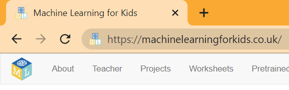
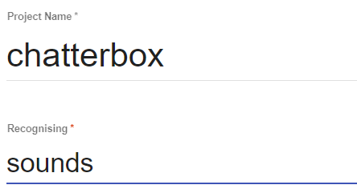
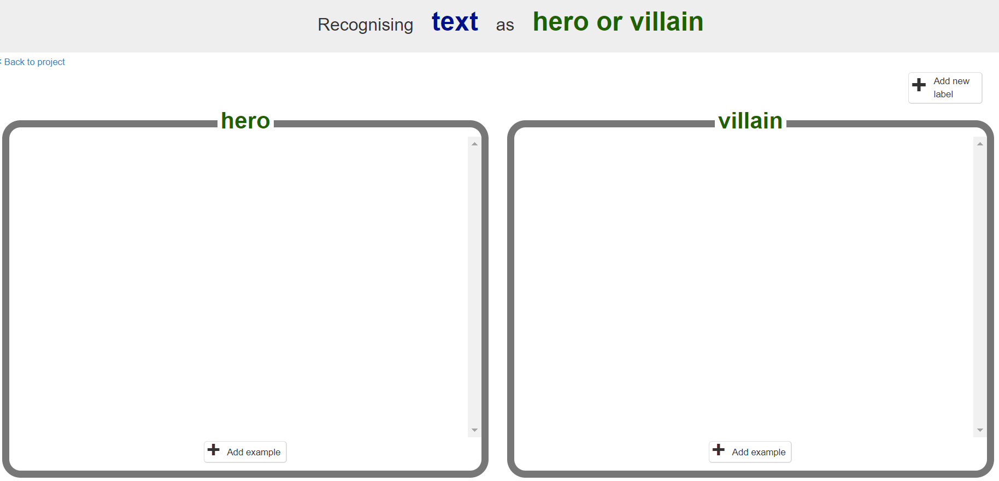
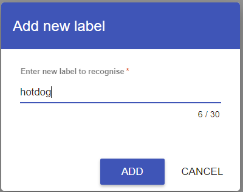
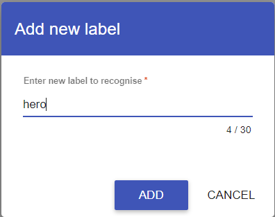

--- task ---

Open the website [Machine Learning for Kids](https://machinelearningforkids.co.uk/#!/login){:target="_blank"}.

--- /task ---

--- task ---

In the screen that appears, choose **Log In**. Enter your username and password on the next screen.

--- /task ---

--- task ---

Select **Go to your Projects**.

--- /task ---

--- task ---

Select **Add a new project**.

--- /task ---

--- task ---

Give the project a name and set it to recognise the type of data you want to work with: `images`, `sounds`, `text` or `numbers`.

--- /task ---

--- task ---

Select **CREATE**. Once created, click on the project title.

--- /task ---

--- task ---

Select **Train**. This will let you add new training data to your model.

--- /task ---

Now that you have created a project, you need to set out the different ways your data will be classified - these will be your **classes**.

--- task ---

Select **Add new label** and create a label for the first class your model will recognise.

**Repeat** this step to create labels for the other classes your model will recognise.

--- /task ---